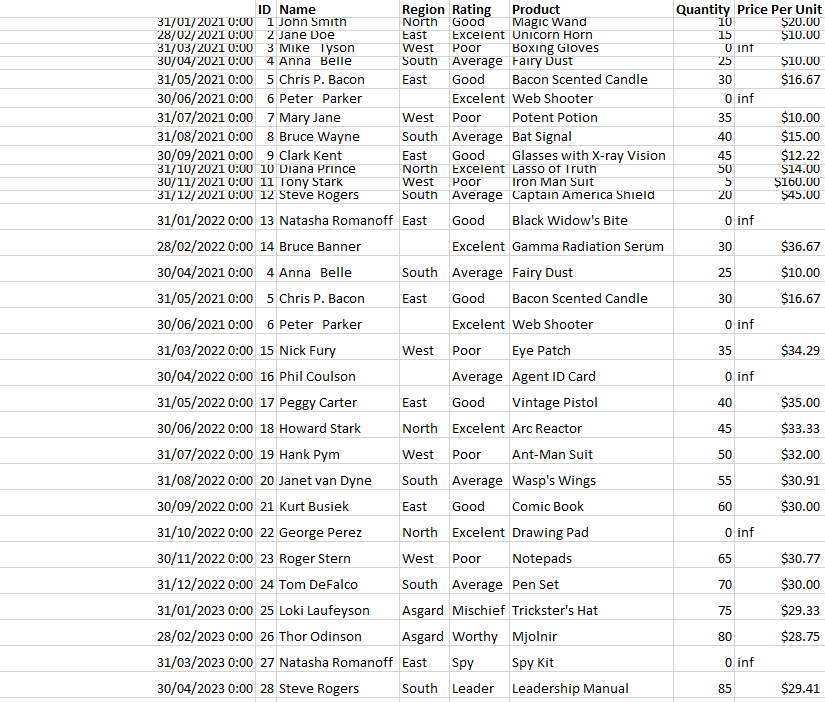
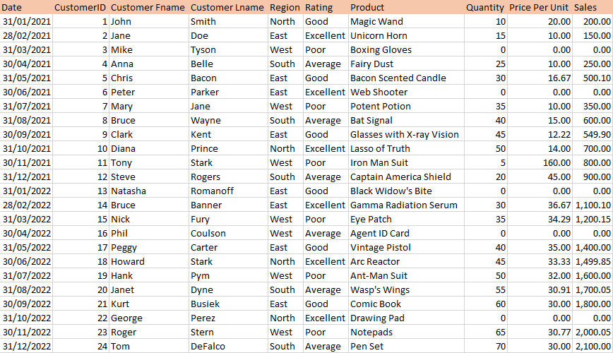
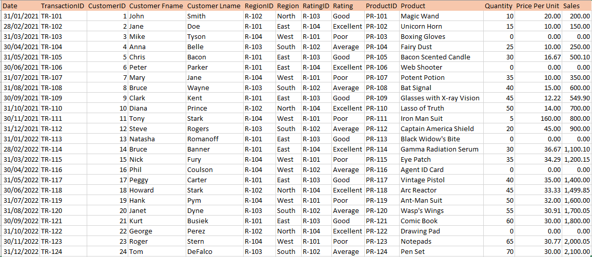
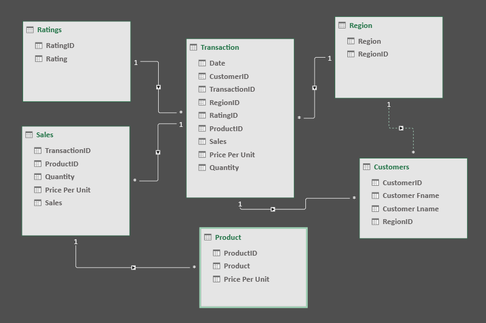

# Midterm Lab Task 1 - Data Cleaning and Preparation using Excel

For this task we are given a Flat data from Excel (See rawfile) and we are Task to perform Data CLeaning and Preparation

## STEP 1 Here's the screenshot of the raw data (See screenshot)

## STEP 2 Here's the screenshot of my output after I started data cleaning (See screenshot)

## STEP 3 Here's the screenshot of the normalization (See screenshot)

## STEP 4 Here's the screenshot of the data model (See screenshot)

